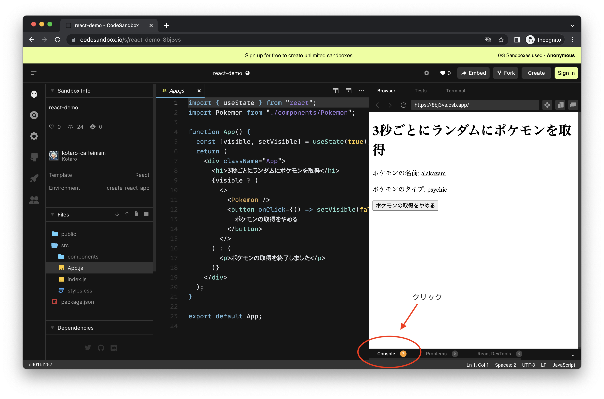
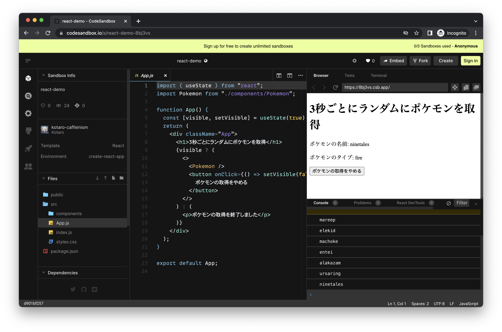

# この React デモの解説

## このデモの内容

PokeAPI を使用し、3 秒ごとにランダムなポケモンを取得し、名前とタイプを表示しています。

## 注意してみてほしいポイント

1. `.src/App.js` と `./src/componets/Pokemon.js` で使用している `useState`
1. `./src/componets/Pokemon.js` で使用している `useEffect`

## 気にしなくて良いポイント

これらの技術も使っていますが、React の動作を理解する上ではこれらは読み飛ばして OK です。

1. 非同期処理
1. setInterval

## 用語解説

- マウント: コンポーネントを最初に初めて読み込み、出力すること
- レンダリング: React コンポーネントを DOM に出力するために様々な情報が読み込まれること
- アンマウント: 不要になった React の要素を消してしまう（もう要らない）
- コンポーネント: React 要素を返す関数
- useState: React ではコンポーネントに state （状態）を持たせるために useState を使用します
- useEffect: React では DOM の操作に直接関係しない部分は useEffect を使用して書きます

## コードの内容

1. App.js ではページのメインとなるコンポーネントを書いています。ここでは `useState` を使用しています

- デフォルトでは取得されたポケモンが表示されています。しかし useState を使用し、「クリックされるとポケモンの表示を消し、非表示にする」という処理を行っています。

```js
function App() {
  const [visible, setVisible] = useState(true); // useState を使用
  return (
    <div className="App">
      <h1>ランダムにポケモンを取得</h1>
      {
        visible ? ( // 三項演算子を使い、今  visible に true が入っているかを確かめます
          <>
            {" "}
            // true が入っていれば Pokemon と、 false にできるボタンを返します
            <Pokemon />
            <button onClick={() => setVisible(false)}>
              ポケモンの取得をやめる
            </button>
          </>
        ) : (
          <p>ポケモンの取得を終了しました</p>
        ) // false が入っていれば、ポケモンとボタンを非表示にし、p タグを表示にします
      }
    </div>
  );
}
```

2. 今度はコンポーネント「Pokemon」の内容を見ていきましょう。 `./src/componets/` の中にあります。

3. Pokemon.js ではポケモンのデータの取得 & 表示を行っています。

4. 今回は難しい関数も書かれていますが、注目してほしい行は以下の通りです。

5. 16 行目 〜 19 行目

6. 4 行目 ・ 5 行目

7. 23 行目 ・ 24 行目

8. 16 行目 〜 19 行目:

- `setInterval` や `clearInterval` については気にしなくて OK ですが、どうしても気になる方は MDN を参照してください。JavaScript のビルトインメソッドで、関数を定期的に実行してくれています。
- ここでは useEffect を使用し、データの取得を行っています。 useEffect の第一引数には実行したい処理を書いた関数が、第二引数には空の `[]` が入っています。つまり 17, 18 行目の処理は React コンポーネントのマウント時とアンマウント時に実行されます。
- useEffect を使用しないとどうなるの？ という点についてはぜひ実際に useEffect をコメントアウトして試してみてください！ 何度も fetch の関数が実行されてしまい大変なことになると思います。これは React がレンダリングのたびにコンポーネントを読み直し、中に書いてあるコードを実行しているためです
- 一番大切なのは 18 行目です。18 行目では「クリーンアップ」を行っています。 Pokemon コンポーネントは後でボタンを押して消す = アンマウントすることができます。ボタンを消した後もデータが fetch され続けていたら... 処理が重くなりますし、無駄なリクエストが増えて PokeAPI にも迷惑になります。ここでは `clearInterval` 関数を使って定期的な関数の実行を止めています。

```js
useEffect(() => {
  const id = setInterval(() => fetchData(), 3000); // 3秒ごとに fetch を実施
  return () => clearInterval(id); // クリーンアップをアンマウント時に実行することで、定期的な関数の実行を止める
}, []); // 角括弧を渡しているのでマウント時とアンマウント時に実行される
```

9. 4 行目 ・ 5 行目:

- ここでは `useState` を使ってポケモンの名前とデータを保存する state を作っています。
- React では通常の変数にデータを保存するとレンダリングされるときに値が消えてしまいます。state として保存するようにしましょう。

10. 23 行目 ・ 24 行目:

- 保存したポケモンの名前とタイプはここで使用しています。
- name と type は state なので、変数として `{}` で囲んで使うことができます！

## 動作確認方法

このリポジトリをクローンするか、[CodeSandbox](https://codesandbox.io/s/react-demo-8bj3vs?file=/src/App.js) で動作確認ができます。
画面を操作しながらコンソールの表示を確認してみてください。CodeSandbox の操作を以下に載せます。




デモの解説は以上です。質問は `#slackoverflow` へお願いします！
